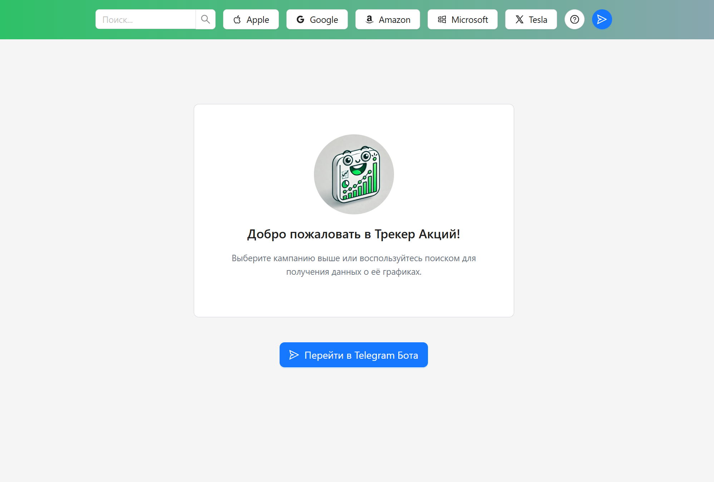
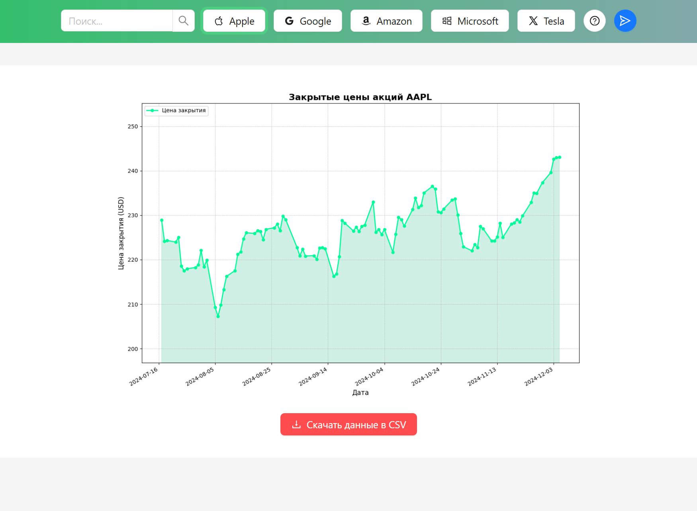

# Трекер акций / Stocks Tracker

Это **FastAPI** + **React** приложение, отслеживающее изменения стоимости акций больших компаний, с визуализацией данных
с помощью графиков.

**Внешний API**: Alpha Vantage, FinnHub



## Преимущества

1. **Актуальная информация**: Данные о стоимости акций обновляются ежедневно, предоставляя пользователям актуальную
   информацию о рынке.
2. **Современные технологии**: В разработке использованы **React** для фронтенда и **FastAPI** для бэкенда, что
   позволяет работать с передовыми инструментами веб-разработки.
3. **Модульность и расширяемость**: Проект спроектирован с учетом возможности легкого расширения функционала в будущем.
4. **Асинхронная обработка**: Асинхронная обработка запросов позволяет не блокировать основной поток и ускоряет отклик
   сервера.
5. **Полный стек**: Проект включает как клиентскую, так и серверную часть, позволяя изучать взаимодействие между ними и
   развивать навыки работы с полным стеком технологий.



## Стек

- **Backend**:
    - Фреймворк: **FastAPI**
    - API запросы (_асинхронно_): aiohttp
    - Графики: pandas + matplotlib
    - Типизация: Pydantic
    - Кэширование: async_lru

- **Frontend**:
    - Фреймворк: **React.js**
    - API (_асинхронно_): axios
    - Стилизация: Tailwind CSS
    - Компоненты: Ant Design
    - Сборка: Vite

## Установка

### 1. Клонирование репозитория

```bash
git clone https://github.com/mamaelyaaa/stocks-tracker-site.git
```

### 2. Создание виртуальных окружений + установка зависимостей

#### 1. Backend

```bash
cd backend/

python -m venv venv
venv/Scripts/activate
pip install -r requirements.txt
```

#### 2. Frontend

```bash
cd frontend

npm install
```

## Запуск

Для запуска обоих серверов необходимо создать файл `.env` и, ориентируясь на файл `.env.example` вписать свои токены,
полученные на сайтах **Alpha Vantage**, **FinnHub**

Для работы приложения убедитесь, что оба сервера запущены.

### Программа запуска

#### 1. Backend

```bash
uvicorn src.main:app --reload
```

#### 2. Frontend (**по нему переходим**)

```bash
npm run dev
```

Поздравляю! Все работает